<p align="center">
  
</p>

<p align="center">
  <strong>Live preview for Neovim</strong> — edit HTML, CSS, and JavaScript, see changes instantly in your browser.
</p>

<p align="center">
  
  
  
  
</p>

---

## Features

- **Live Preview** — see changes instantly in your browser as you edit
- **Real-time Sync** — HTML, CSS, and JavaScript changes are reflected immediately
- **Cursor Tracking** — highlights the element under your cursor in the browser
- **CSS Selection** — click browser elements to jump to corresponding CSS rules
- **Error Display** — shows HTML/CSS validation errors inline
- **WebSocket Communication** — fast, persistent connection between editor and browser
- **Diff-based Updates** — efficient DOM updates using minimal operations
- **TypeScript Support** — live preview for `.ts` and `.tsx` files
- **WebSocket Reconnection** — automatic reconnection with visual status indicator
- **Custom Error Handlers** — configurable HTML/CSS validation rules
- **Mobile Preview** — QR code generation for testing on mobile devices
- **Debounced Updates** — efficient bandwidth usage with 100ms debounce

## Architecture

```
                         render.nvim
  ┌──────────────────────────────────────────────────────────────────┐
  │                                                                  │
  │   ┌──────────┐   HTTP    ┌──────────┐  WebSocket  ┌──────────┐   │
  │   │  Neovim  │ ────────→ │  Node.js │ ──────────→ │ Browser  │   │
  │   │  Plugin   │          │  Server  │             │  Client  │   │
  │   └────┬─────┘           └────┬─────┘             └────▲─────┘   │
  │        │                      │                        │         │
  │        │  subprocess          │  serve HTML + inject   │         │
  │        │                      │  diff updates          │         │
  │        ▼                      ▼                        │         │
  │   ┌──────────┐         ┌──────────┐                    │         │
  │   │  Python  │         │  AST     │   DOM patching     │         │
  │   │  Bridge  │         │  Parser  │ ───────────────────┘         │
  │   └──────────┘         └──────────┘                              │
  │                            htmlparser2                           │
  │                            postcss                               │
  └──────────────────────────────────────────────────────────────────┘
```

| Layer | Role | Technology |
|-------|------|-----------|
| **Neovim** | Editor integration, autocmds, debounce | Vimscript / Lua |
| **Python** | Process bridge, HTTP client | Python 2.7+ / 3.x |
| **Node.js** | HTTP + WebSocket server, file serving | Node.js 12+ |
| **Parser** | HTML AST diffing, CSS validation | htmlparser2, postcss, csslint |
| **Browser** | Live DOM updates, element highlighting | Vanilla JS (zero deps) |

## Installation

### Prerequisites

- **Neovim** or **Vim** with Python support
- **Node.js** (v12 or higher)
- **Python** 2.7+ or 3.x

### Using lazy.nvim

```lua
{
  'Hishantik/render.nvim',
  ft = { 'html', 'css', 'javascript', 'typescript', 'tsx' },
  build = function()
    local plugin_dir = vim.fn.stdpath('data') .. '/lazy/render.nvim'
    vim.fn.system('npm install --prefix ' .. plugin_dir .. '/server')
  end,
}
```

### Using vim-plug

```vim
Plug 'hishantik/render.nvim'
```

After installation:
```bash
cd ~/.local/share/nvim/site/pack/render/start/render.nvim
npm install --prefix server
```

### Using packer.nvim

```lua
use 'hishantik/render.nvim'
```

After installation:
```bash
cd ~/.local/share/nvim/site/pack/packer/start/render.nvim
npm install --prefix server
```

### Manual Installation

```bash
git clone https://github.com/hishantik/render.nvim.git ~/.config/nvim/plugged/render.nvim
cd ~/.config/nvim/plugged/render.nvim/server
npm install
```

### Termux (Android)

```bash
pkg install neovim nodejs termux-open iproute2

mkdir -p ~/.config/nvim/plugged
git clone https://github.com/hishantik/render.nvim.git ~/.config/nvim/plugged/render.nvim
cd ~/.config/nvim/plugged/render.nvim/server
npm install --ignore-scripts
```

> `termux-open` is required for opening URLs on Android. `--ignore-scripts` skips native C++ compilation that fails without NDK. `iproute2` provides the `ip` command for LAN IP detection.

On Termux, `/tmp` is read-only. Configure the log path:

```lua
vim.g.render_server_log = vim.fn.stdpath('data') .. '/render_server_logfile'
```

## Usage

### Commands

| Command | Description |
|---------|-------------|
| `:Render` | Start the server and open browser |
| `:RenderStop` | Stop the server |
| `:RenderReload` | Force reload the page |
| `:RenderEval {code}` | Execute JavaScript in browser |
| `:RenderMobile` | Open QR code page for mobile preview |
| `:RenderConfigure {type} {rules}` | Configure validation rules |
| `:RenderConfig` | Open config file (init.vim/init.lua) |

### Quick Start

```vim
:e index.html
:Render
" Edit your files — changes appear instantly in the browser
:RenderStop
```

### TypeScript

`.ts` and `.tsx` files are automatically supported. Just open and `:Render` as usual.

### Mobile Preview

Test on mobile devices connected to the same network:

```lua
-- In init.lua
vim.g.render_server_allow_remote_connections = 1
```

```vim
:Render
:RenderMobile    " Opens QR code page — scan with your phone
```

## Configuration

| Option | Default | Description |
|--------|---------|-------------|
| `g:render_browser_command` | `0` | Browser launch command (0 = auto) |
| `g:render_auto_start_browser` | `1` | Auto-open browser on start |
| `g:render_auto_start_server` | `1` | Auto-start Node server |
| `g:render_eval_on_save` | `1` | Evaluate JS on save |
| `g:render_refresh_on_save` | `0` | Reload page on save |
| `g:render_server_port` | `pid-based` | Server port number |
| `g:render_server_path` | `http://127.0.0.1` | Server URL |
| `g:render_server_log` | `/tmp/render_server_logfile` | Server log path |
| `g:render_html_rules` | `{}` | Custom HTML validation rules |
| `g:render_csslint_rules` | `[]` | Custom CSSLint rules |
| `g:render_server_allow_remote_connections` | `0` | Allow mobile/network access |

### Example (Lua)

```lua
vim.g.render_browser_command = 'google-chrome'
vim.g.render_auto_start_browser = 0
vim.g.render_refresh_on_save = 1
vim.g.render_server_allow_remote_connections = 1
vim.g.render_server_port = 8080

vim.g.render_html_rules = {
  ['tag-pair'] = true,
  ['doctype-first'] = false,
}

vim.g.render_csslint_rules = { 'compatible-vendor-prefixes' }
```

### Example (Vimscript)

```vim
let g:render_browser_command = 'google-chrome'
let g:render_auto_start_browser = 0
let g:render_refresh_on_save = 1
let g:render_server_allow_remote_connections = 1
let g:render_server_port = 8080

let g:render_html_rules = {
  \ 'tag-pair': v:true,
  \ 'doctype-first': v:false
\}

let g:render_csslint_rules = ['compatible-vendor-prefixes']
```

Use `:RenderConfig` to quickly open your config file.

## How It Works

1. **Server Start** — Python bridge launches Node.js server
2. **File Serving** — HTML parsed into AST, client scripts injected
3. **Change Detection** — Vim events trigger content sync (debounced 100ms)
4. **Diff Updates** — server computes minimal DOM operations
5. **Broadcast** — changes sent via WebSocket to browser
6. **Apply** — client updates DOM with minimal operations

### WebSocket Reconnection

Automatic handling with exponential backoff:

1. Connection lost → status indicator shows "reconnecting..."
2. Exponential backoff: 1s, 2s, 4s, 8s... up to 30s max
3. Connection restored → status indicator disappears

## Performance

| Operation | Latency |
|-----------|---------|
| Local round-trip | 5-20ms |
| Initial HTML parse | 50-200ms |
| Diff update | 1-5ms |
| Debounce delay | 100ms |

## License

[GPL-3.0](LICENSE)

## Author

**Hishantik**

- GitHub: [hishantik](https://github.com/hishantik)
- Repository: [render.nvim](https://github.com/hishantik/render.nvim)

## Contributing

Contributions are welcome! Feel free to submit issues and pull requests.

## Acknowledgments

Originally based on [bracey.vim](https://github.com/turbio/bracey.vim) by Mason Clayton.
